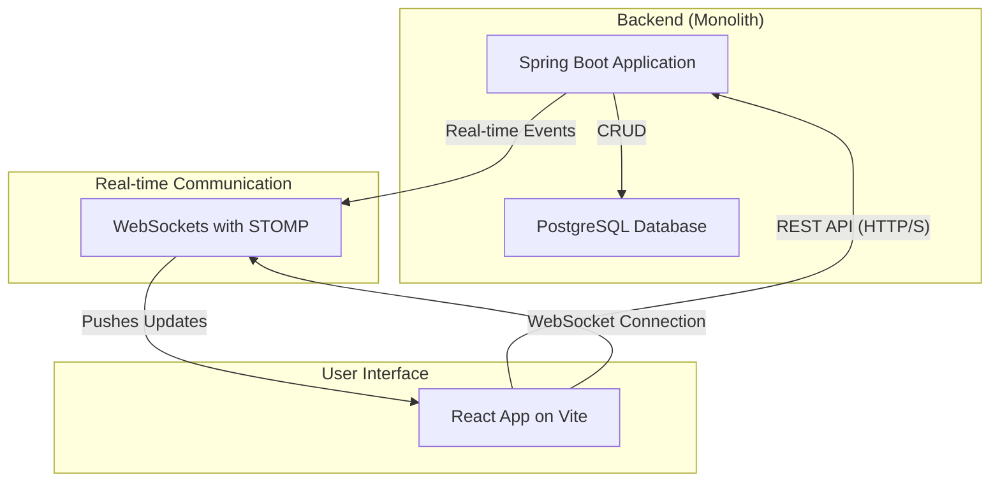
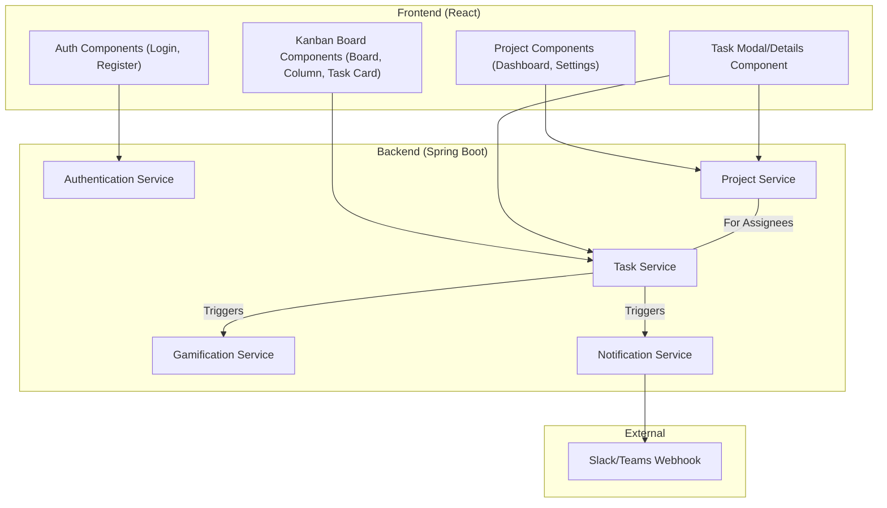
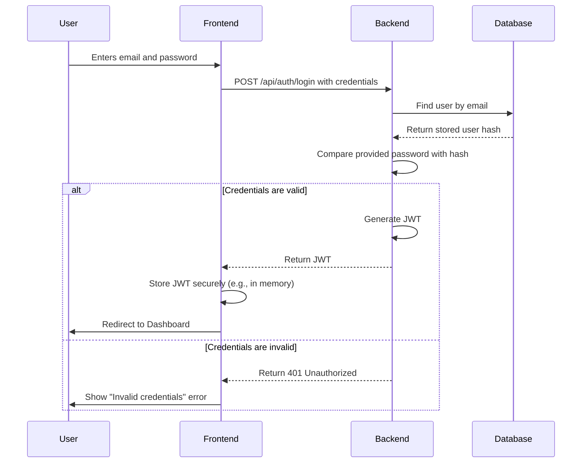
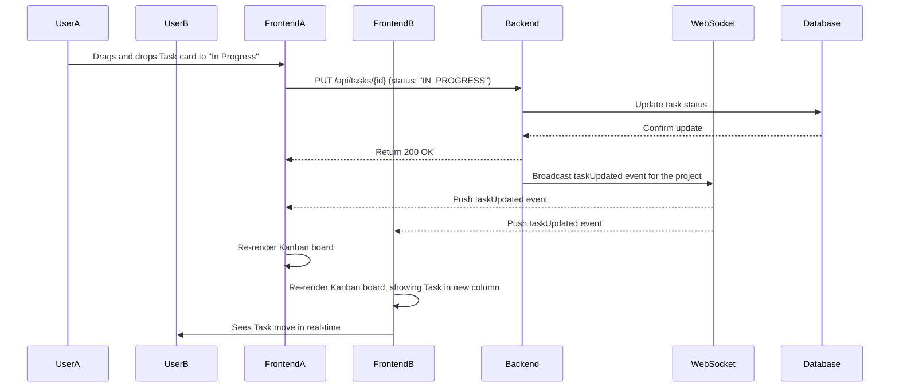
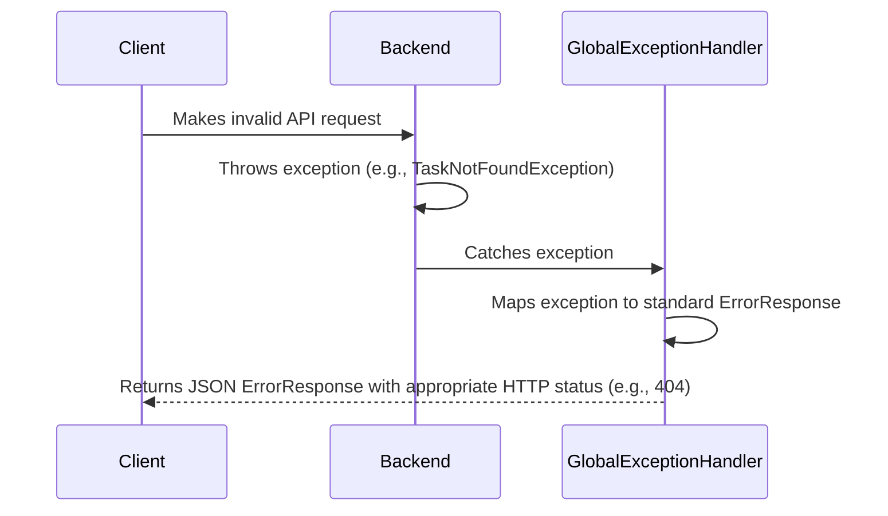

# TaskFlow Fullstack Architecture Document

## Introduction

This document outlines the complete fullstack architecture for **TaskFlow**, including backend systems, frontend implementation, and their integration. It serves as the single source of truth for AI-driven development, ensuring consistency across the entire technology stack.

This unified approach combines what would traditionally be separate backend and frontend architecture documents, streamlining the development process for modern fullstack applications where these concerns are increasingly intertwined.

### Starter Template or Existing Project

N/A - Greenfield project

### Change Log

| Date         | Version | Description                | Author    |
| :----------- | :------ | :------------------------- | :-------- |
| 2025-11-05   | 1.0     | Initial architecture draft | Winston   |

## High Level Architecture

### Technical Summary

This document outlines the architecture for TaskFlow, a desktop-first responsive web application designed to enhance productivity through a human-centric, reward-based system. The system will be built as a monolith with clear logical boundaries, utilizing a Java-based Spring Boot backend and a React (Vite) frontend with TypeScript. A PostgreSQL database will handle data persistence, while real-time communication for collaborative features will be managed via WebSockets (STOMP). The entire project will be housed in a monorepo to streamline development and ensure consistency. This architecture directly supports the PRD goals by providing a scalable, maintainable, and secure foundation for the core task management, collaboration, and gamification features.

### Platform and Infrastructure Choice

**Platform:** Local-Only for MVP
**Key Services:** N/A (Local machine hosting)
**Deployment Host and Regions:** N/A (Local machine hosting)
**Rationale:** As per the PRD, the initial MVP will be for local hosting and development only. No cloud infrastructure is required at this stage.

### Repository Structure

**Structure:** Monorepo
**Monorepo Tool:** Standard NPM/Maven workspaces. No specialized tool like Nx or Turborepo is required for the MVP's complexity.
**Package Organization:** The monorepo will contain two primary packages: `backend` for the Spring Boot application and `frontend` for the React/Vite application. A `packages/shared-types` directory may be added later if needed for sharing TypeScript interfaces.

### High Level Architecture Diagram



### Architectural Patterns

- **Monolithic Architecture:** The application will be built as a single, unified service. _Rationale:_ This simplifies development, testing, and deployment for the MVP, aligning with NFR4. Clear logical boundaries will be maintained to allow for future migration to microservices if needed.
- **Repository Pattern:** The backend will use the repository pattern to abstract data access logic from the business logic. _Rationale:_ This improves testability and allows for easier changes to the underlying data source in the future.
- **REST API:** The primary communication between the frontend and backend will be via a RESTful API. _Rationale:_ This is a mature, well-understood standard that provides a clear and stateless contract between the client and server.
- **Component-Based UI:** The frontend will be built using reusable React components. _Rationale:_ This promotes maintainability, reusability, and a consistent user interface.
- **Real-time Communication (Observer Pattern):** WebSockets will be used to push real-time updates to clients. _Rationale:_ This is essential for collaborative features like the Kanban board, ensuring all users see changes instantly (NFR3, NFR5).

## Tech Stack

### Technology Stack Table

| Category | Technology | Version | Purpose | Rationale |
|---|---|---|---|---|
| Frontend Language | TypeScript | ~5.x | Type safety for JavaScript | Enhances code quality and maintainability. |
| Frontend Framework | React | ~18.x | Building user interfaces | Modern, component-based, and widely adopted. Specified in PRD. |
| UI Component Library | Material-UI (MUI) | ~5.x | Pre-built UI components | Accelerates development with a modern, professional look. |
| State Management | Zustand | ~4.x | Global state management | Simple, unopinionated, and less boilerplate than Redux. Good for MVP. |
| Backend Language | Java | 17 | General-purpose backend language | Mature, robust, and performant. Specified in PRD. |
| Backend Framework | Spring Boot | ~3.x | Building backend applications | Rapid development, extensive ecosystem. Specified in PRD. |
| API Style | REST | N/A | Client-server communication | Mature, well-understood standard. Specified in PRD. |
| Database | PostgreSQL | 15+ | Relational data storage | Powerful, open-source, and reliable. Specified in PRD. |
| Cache | N/A | N/A | N/A | Not required for MVP. Can be added later if performance bottlenecks are identified. |
| File Storage | Local Filesystem | N/A | Storing task attachments | Sufficient for local-only MVP. Will be replaced by a cloud service (e.g., S3) for production. |
| Authentication | JWT | N/A | Secure API authentication | Stateless, industry-standard approach. Specified in PRD. |
| Frontend Testing | Vitest / RTL | Latest | Unit & Component Testing | Fast, modern testing framework that integrates well with Vite. |
| Backend Testing | JUnit 5 / Mockito | Latest | Unit & Integration Testing | Standard testing stack for Java/Spring Boot. |
| E2E Testing | Playwright | Latest | End-to-end testing | Modern, reliable, and fast E2E testing framework. |
| Build Tool | Maven | ~3.8.x | Backend dependency management | Standard build tool for Java projects. |
| Bundler | Vite | ~5.x | Frontend build/dev server | Fast, modern, and specified in PRD. |
| IaC Tool | N/A | N/A | N/A | Not required for local-only MVP. |
| CI/CD | N/A | N/A | N/A | Not required for local-only MVP. |
| Monitoring | Spring Boot Actuator | ~3.x | Basic backend monitoring | Provides basic health checks and metrics for local debugging. |
| Logging | SLF4J with Logback | Bundled | Application logging | Standard logging facade for Spring Boot. |
| CSS Framework | Emotion | ~11.x | CSS-in-JS styling | Comes integrated with Material-UI for flexible styling. |

## Data Models

This section defines the core data entities for the TaskFlow application. These models are derived from the functional requirements and user stories in the PRD.

### User

**Purpose:** Represents an individual who can log in and interact with the application.

**Key Attributes:**
- `id`: `UUID` - Unique identifier for the user.
- `email`: `String` - User's email address, used for login. Must be unique.
- `password`: `String` - Hashed and salted password.
- `role`: `Enum` - User's role (`ADMINISTRATOR`, `MANAGER`, `COLLABORATOR`).
- `createdAt`: `Timestamp` - When the user account was created.

#### TypeScript Interface
```typescript
export enum UserRole {
  ADMINISTRATOR = 'ADMINISTRATOR',
  MANAGER = 'MANAGER',
  COLLABORATOR = 'COLLABORATOR',
}

export interface User {
  id: string; // UUID
  email: string;
  role: UserRole;
  createdAt: string; // ISO 8601
}
```

#### Relationships
- One-to-Many: A `User` can be assigned to many `Tasks`.
- Many-to-Many: A `User` can be a member of many `Projects`.

### Project

**Purpose:** A container for organizing related tasks and team members.

**Key Attributes:**
- `id`: `UUID` - Unique identifier for the project.
- `name`: `String` - The name of the project.
- `description`: `String` - A brief description of the project.
- `createdAt`: `Timestamp` - When the project was created.

#### TypeScript Interface
```typescript
export interface Project {
  id: string; // UUID
  name: string;
  description?: string;
  members: User[];
  createdAt: string; // ISO 8601
}
```

#### Relationships
- Many-to-Many: A `Project` can have many `Users` (members).
- One-to-Many: A `Project` can have many `Tasks`.

### Task

**Purpose:** Represents a single unit of work to be completed.

**Key Attributes:**
- `id`: `UUID` - Unique identifier for the task.
- `title`: `String` - The title of the task.
- `description`: `String` - Detailed description of the task.
- `status`: `Enum` - Current status (`TO_DO`, `IN_PROGRESS`, `COMPLETED`).
- `priority`: `Enum` - Priority level (`LOW`, `MEDIUM`, `HIGH`).
- `dueDate`: `Date` - When the task is due.
- `createdAt`: `Timestamp` - When the task was created.

#### TypeScript Interface
```typescript
export enum TaskStatus {
  TO_DO = 'TO_DO',
  IN_PROGRESS = 'IN_PROGRESS',
  COMPLETED = 'COMPLETED',
}

export enum TaskPriority {
  LOW = 'LOW',
  MEDIUM = 'MEDIUM',
  HIGH = 'HIGH',
}

export interface Task {
  id: string; // UUID
  title: string;
  description?: string;
  status: TaskStatus;
  priority: TaskPriority;
  dueDate?: string; // ISO 8601 Date
  assignee?: User;
  project: Project;
  comments: Comment[];
  attachments: Attachment[];
  createdAt: string; // ISO 8601
}
```

#### Relationships
- Many-to-One: Many `Tasks` belong to one `Project`.
- Many-to-One: Many `Tasks` can be assigned to one `User`.
- One-to-Many: A `Task` can have many `Comments`.
- One-to-Many: A `Task` can have many `Attachments`.

### Comment

**Purpose:** Represents a comment made on a task for collaboration.

**Key Attributes:**
- `id`: `UUID` - Unique identifier for the comment.
- `content`: `String` - The text of the comment.
- `createdAt`: `Timestamp` - When the comment was posted.

#### TypeScript Interface
```typescript
export interface Comment {
  id: string; // UUID
  content: string;
  author: User;
  createdAt: string; // ISO 8601
}
```

#### Relationships
- Many-to-One: Many `Comments` belong to one `Task`.
- Many-to-One: Many `Comments` are written by one `User` (author).

### Attachment

**Purpose:** Represents a file attached to a task.

**Key Attributes:**
- `id`: `UUID` - Unique identifier for the attachment.
- `fileName`: `String` - The name of the uploaded file.
- `fileUrl`: `String` - The path or URL to access the file.
- `fileType`: `String` - The MIME type of the file.
- `uploadedAt`: `Timestamp` - When the file was uploaded.

#### TypeScript Interface
```typescript
export interface Attachment {
  id: string; // UUID
  fileName: string;
  fileUrl: string;
  fileType: string;
  uploadedAt: string; // ISO 8601
}
```

#### Relationships
- Many-to-One: Many `Attachments` belong to one `Task`.

### Badge

**Purpose:** Represents a gamification achievement that users can earn.

**Key Attributes:**
- `id`: `UUID` - Unique identifier for the badge.
- `name`: `String` - The name of the badge (e.g., "First Task Completed").
- `description`: `String` - How to earn the badge.
- `iconUrl`: `String` - URL to the badge's icon.

#### TypeScript Interface
```typescript
export interface Badge {
  id: string; // UUID
  name: string;
  description: string;
  iconUrl: string;
}
```

#### Relationships
- Many-to-Many: A `Badge` can be earned by many `Users`.

## API Specification

This section defines the REST API for the TaskFlow application. The API will be documented using Swagger (SpringDoc), and the specification will adhere to the OpenAPI 3.0 standard.

### REST API Specification

```yaml
openapi: 3.0.0
info:
  title: TaskFlow API
  version: 1.0.0
  description: API for the TaskFlow project management application.
servers:
  - url: http://localhost:8080/api
    description: Local development server

paths:
  /auth/register:
    post:
      summary: Register a new user
      description: Creates a new user account with the 'COLLABORATOR' role.
      # Request body and responses would be defined here
  /auth/login:
    post:
      summary: Log in a user
      description: Authenticates a user and returns a JWT.
      # Request body and responses would be defined here

  /projects:
    get:
      summary: Get all projects for the current user
      description: Returns a list of projects the authenticated user is a member of.
    post:
      summary: Create a new project
      description: Creates a new project and assigns the creator as a manager.

  /projects/{projectId}:
    get:
      summary: Get a single project by ID
      description: Returns detailed information about a specific project.
    put:
      summary: Update a project
      description: Updates the name or description of a project.

  /projects/{projectId}/tasks:
    get:
      summary: Get all tasks for a project
      description: Returns a list of all tasks associated with a specific project.
    post:
      summary: Create a new task in a project
      description: Creates a new task and links it to the specified project.

  /tasks/{taskId}:
    get:
      summary: Get a single task by ID
      description: Returns detailed information about a specific task.
    put:
      summary: Update a task
      description: Updates a task's details (title, status, assignee, etc.).
    delete:
      summary: Delete a task
      description: Deletes a task from the system.

  /tasks/{taskId}/comments:
    get:
      summary: Get all comments for a task
      description: Returns a list of all comments on a specific task.
    post:
      summary: Add a comment to a task
      description: Creates a new comment on a specific task.

  /tasks/{taskId}/attachments:
    post:
      summary: Attach a file to a task
      description: Uploads a file and attaches it to a specific task.

  /users/me/badges:
    get:
      summary: Get badges for the current user
      description: Returns a list of badges earned by the authenticated user.
```

## Components

This section breaks down the TaskFlow application into its major logical components, covering both the backend services and the frontend UI modules.

### Component Diagram



### Backend Components

#### Authentication Service
- **Responsibility:** Manages user registration, login, and JWT generation/validation.
- **Key Interfaces:** `POST /api/auth/register`, `POST /api/auth/login`.
- **Dependencies:** `User` data model, Security module (for password hashing).
- **Technology Stack:** Spring Security, JJWT library.

#### Project Service
- **Responsibility:** Handles all business logic related to projects, including creation, updates, and member management.
- **Key Interfaces:** `GET /api/projects`, `POST /api/projects`, `PUT /api/projects/{id}`.
- **Dependencies:** `Project` and `User` data models.
- **Technology Stack:** Spring Boot, Spring Data JPA.

#### Task Service
- **Responsibility:** Manages all business logic for tasks, comments, and attachments. Handles status updates and real-time notifications.
- **Key Interfaces:** `GET /api/projects/{id}/tasks`, `POST /api/tasks`, `PUT /api/tasks/{id}`, etc.
- **Dependencies:** `Task`, `Comment`, `Attachment` data models, `Gamification Service`, `Notification Service`.
- **Technology Stack:** Spring Boot, Spring Data JPA, Spring WebSockets.

#### Gamification Service
- **Responsibility:** Contains the logic for awarding badges to users based on their actions (e.g., completing a certain number of tasks).
- **Key Interfaces:** Internal Java methods called by other services (e.g., `awardBadgesForTaskCompletion(User user)`).
- **Dependencies:** `Badge` and `User` data models.
- **Technology Stack:** Spring Boot.

#### Notification Service
- **Responsibility:** Sends notifications to external services (Slack/Teams) via webhooks when configured.
- **Key Interfaces:** Internal Java methods (e.g., `sendTaskCompletionNotification(Task task)`).
- **Dependencies:** `Project` data model (to get webhook URL).
- **Technology Stack:** Spring Boot, HTTP Client (e.g., `RestTemplate` or `WebClient`).

### Frontend Components

#### Auth Components
- **Responsibility:** Provide UI for user registration and login. Manage JWT storage in the client.
- **Key Interfaces:** Login form, Registration form.
- **Dependencies:** Authentication Service (backend).
- **Technology Stack:** React, Vitest/RTL.

#### Project Components
- **Responsibility:** Display the main dashboard, list projects, and allow users to create and manage project settings.
- **Key Interfaces:** Project list view, "Create Project" modal, Project settings page.
- **Dependencies:** Project Service (backend).
- **Technology Stack:** React, Zustand (for state), Material-UI.

#### Kanban Board Components
- **Responsibility:** Render the main Kanban view with columns and task cards. Handle drag-and-drop interactions for changing task status.
- **Key Interfaces:** Kanban board, Columns, Task cards.
- **Dependencies:** Task Service (backend), WebSockets for real-time updates.
- **Technology Stack:** React, a drag-and-drop library (e.g., `dnd-kit`), Material-UI.

#### Task Modal/Details Component
- **Responsibility:** Display the full details of a task. Allow users to edit task properties, add comments, and attach files.
- **Key Interfaces:** Task detail modal/page.
- **Dependencies:** Task Service (backend).
- **Technology Stack:** React, Material-UI.

## External APIs

The only external integrations for the MVP are webhook notifications to communication platforms.

### Slack / Microsoft Teams API

- **Purpose:** To send real-time notifications about task status changes.
- **Documentation:** N/A (Uses standard incoming webhooks provided by Slack/Teams).
- **Base URL(s):** User-configured webhook URL.
- **Authentication:** N/A (Token is included in the webhook URL).
- **Rate Limits:** To be managed by the external platform. The application should handle potential `429 Too Many Requests` errors gracefully.
- **Key Endpoints Used:** `POST {{user_provided_webhook_url}}`
- **Integration Notes:** The `Notification Service` will be responsible for constructing and sending a simple JSON payload to the configured URL.

## Core Workflows

This section illustrates key user and system interactions using sequence diagrams.

### User Login Workflow



### Real-time Task Status Update Workflow



## Database Schema

This is a preliminary DDL for the PostgreSQL database based on the defined data models.

```sql
-- Users Table
CREATE TABLE users (
    id UUID PRIMARY KEY DEFAULT gen_random_uuid(),
    email VARCHAR(255) UNIQUE NOT NULL,
    password_hash VARCHAR(255) NOT NULL,
    role VARCHAR(50) NOT NULL CHECK (role IN ('ADMINISTRATOR', 'MANAGER', 'COLLABORATOR')),
    created_at TIMESTAMPTZ NOT NULL DEFAULT now()
);

-- Projects Table
CREATE TABLE projects (
    id UUID PRIMARY KEY DEFAULT gen_random_uuid(),
    name VARCHAR(255) NOT NULL,
    description TEXT,
    created_at TIMESTAMPTZ NOT NULL DEFAULT now()
);

-- Project Members Junction Table
CREATE TABLE project_members (
    project_id UUID NOT NULL REFERENCES projects(id) ON DELETE CASCADE,
    user_id UUID NOT NULL REFERENCES users(id) ON DELETE CASCADE,
    PRIMARY KEY (project_id, user_id)
);

-- Tasks Table
CREATE TABLE tasks (
    id UUID PRIMARY KEY DEFAULT gen_random_uuid(),
    title VARCHAR(255) NOT NULL,
    description TEXT,
    status VARCHAR(50) NOT NULL CHECK (status IN ('TO_DO', 'IN_PROGRESS', 'COMPLETED')),
    priority VARCHAR(50) NOT NULL CHECK (priority IN ('LOW', 'MEDIUM', 'HIGH')),
    due_date DATE,
    project_id UUID NOT NULL REFERENCES projects(id) ON DELETE CASCADE,
    assignee_id UUID REFERENCES users(id),
    created_at TIMESTAMPTZ NOT NULL DEFAULT now()
);

-- Comments Table
CREATE TABLE comments (
    id UUID PRIMARY KEY DEFAULT gen_random_uuid(),
    content TEXT NOT NULL,
    task_id UUID NOT NULL REFERENCES tasks(id) ON DELETE CASCADE,
    author_id UUID NOT NULL REFERENCES users(id),
    created_at TIMESTAMPTZ NOT NULL DEFAULT now()
);

-- Attachments Table
CREATE TABLE attachments (
    id UUID PRIMARY KEY DEFAULT gen_random_uuid(),
    file_name VARCHAR(255) NOT NULL,
    file_url VARCHAR(1024) NOT NULL,
    file_type VARCHAR(100),
    task_id UUID NOT NULL REFERENCES tasks(id) ON DELETE CASCADE,
    uploaded_at TIMESTAMPTZ NOT NULL DEFAULT now()
);

-- Badges Table
CREATE TABLE badges (
    id UUID PRIMARY KEY DEFAULT gen_random_uuid(),
    name VARCHAR(255) UNIQUE NOT NULL,
    description TEXT,
    icon_url VARCHAR(1024)
);

-- User Badges Junction Table
CREATE TABLE user_badges (
    user_id UUID NOT NULL REFERENCES users(id) ON DELETE CASCADE,
    badge_id UUID NOT NULL REFERENCES badges(id) ON DELETE CASCADE,
    awarded_at TIMESTAMPTZ NOT NULL DEFAULT now(),
    PRIMARY KEY (user_id, badge_id)
);

-- Add indexes for performance
CREATE INDEX idx_tasks_project_id ON tasks(project_id);
CREATE INDEX idx_tasks_assignee_id ON tasks(assignee_id);
CREATE INDEX idx_comments_task_id ON comments(task_id);
```

## Frontend Architecture

### Component Architecture

#### Component Organization
The frontend will follow a feature-based directory structure.

```text
frontend/
└── src/
    ├── assets/
    ├── components/
    │   ├── common/       # Reusable components (Button, Input, Modal)
    │   └── layout/       # Layout components (Navbar, Sidebar)
    ├── features/
    │   ├── auth/         # Login, Register components and hooks
    │   ├── projects/     # Project list, creation, settings
    │   └── tasks/        # Kanban board, columns, cards, task details
    ├── hooks/            # Global custom hooks
    ├── services/         # API client services
    ├── stores/           # Zustand state stores
    ├── styles/
    └── App.tsx
```

#### Component Template
A typical component will be a function component with TypeScript props.
```typescript
import React from 'react';

interface MyComponentProps {
  title: string;
}

const MyComponent: React.FC<MyComponentProps> = ({ title }) => {
  return (
    <div>
      <h1>{title}</h1>
    </div>
  );
};

export default MyComponent;
```

### State Management Architecture

#### State Structure
A Zustand store will be created for global state like the authenticated user. Feature-specific state will be managed locally or in feature-specific stores.
```typescript
import { create } from 'zustand';
import { User } from '../types'; // Assuming shared types

interface AuthState {
  user: User | null;
  token: string | null;
  setUser: (user: User, token: string) => void;
  logout: () => void;
}

export const useAuthStore = create<AuthState>((set) => ({
  user: null,
  token: null,
  setUser: (user, token) => set({ user, token }),
  logout: () => set({ user: null, token: null }),
}));
```

#### State Management Patterns
- **Global State:** Use Zustand for user authentication state.
- **Local State:** Use React's `useState` and `useReducer` for component-level state.
- **Server Cache State:** Use a library like `TanStack Query (React Query)` to manage server state, caching, and real-time updates.

### Routing Architecture

#### Route Organization
Routing will be managed using `react-router-dom`.
```text
/login
/register
/dashboard (protected)
/project/{projectId} (protected)
/task/{taskId} (protected)
/profile (protected)
```

#### Protected Route Pattern
A wrapper component will protect routes that require authentication.
```typescript
import { Navigate, Outlet } from 'react-router-dom';
import { useAuthStore } from '../stores/authStore';

const ProtectedRoute = () => {
  const { token } = useAuthStore();
  return token ? <Outlet /> : <Navigate to="/login" />;
};

// Usage in App.tsx
<Route element={<ProtectedRoute />}>
  <Route path="/dashboard" element={<Dashboard />} />
</Route>
```

### Frontend Services Layer

#### API Client Setup
An Axios instance will be configured to handle API requests, including adding the JWT to headers.
```typescript
import axios from 'axios';
import { useAuthStore } from '../stores/authStore';

const apiClient = axios.create({
  baseURL: 'http://localhost:8080/api',
});

apiClient.interceptors.request.use((config) => {
  const token = useAuthStore.getState().token;
  if (token) {
    config.headers.Authorization = `Bearer ${token}`;
  }
  return config;
});

export default apiClient;
```

#### Service Example
Services will encapsulate API calls for different features.
```typescript
import apiClient from './apiClient';
import { Task } from '../types';

export const taskService = {
  getTasksForProject: (projectId: string): Promise<Task[]> => {
    return apiClient.get(`/projects/${projectId}/tasks`).then(res => res.data);
  },
  updateTask: (taskId: string, data: Partial<Task>): Promise<Task> => {
    return apiClient.put(`/tasks/${taskId}`, data).then(res => res.data);
  },
};
```

## Backend Architecture

### Service Architecture

#### Controller/Route Organization
The backend will follow a standard layered architecture: Controller -> Service -> Repository.
```text
backend/
└── src/main/java/com/taskflow/
    ├── config/         # Security, WebSocket config
    ├── controller/     # API endpoints (TaskController, AuthController)
    ├── dto/            # Data Transfer Objects
    ├── exception/      # Custom exception handlers
    ├── model/          # JPA Entities (Task, User)
    ├── repository/     # Spring Data JPA interfaces (TaskRepository)
    ├── service/        # Business logic (TaskService)
    └── TaskflowApplication.java
```

#### Controller Template
```java
@RestController
@RequestMapping("/api/tasks")
public class TaskController {

    @Autowired
    private TaskService taskService;

    @PutMapping("/{id}")
    public ResponseEntity<TaskDTO> updateTask(@PathVariable UUID id, @RequestBody UpdateTaskDTO taskDTO) {
        TaskDTO updatedTask = taskService.updateTask(id, taskDTO);
        return ResponseEntity.ok(updatedTask);
    }
}
```

### Database Architecture

#### Schema Design
The schema is defined in the `Database Schema` section above using SQL DDL.

#### Data Access Layer
The Repository pattern will be implemented using Spring Data JPA interfaces.
```java
import org.springframework.data.jpa.repository.JpaRepository;
import java.util.UUID;

public interface TaskRepository extends JpaRepository<Task, UUID> {
    List<Task> findByProjectId(UUID projectId);
}
```

### Authentication and Authorization

#### Auth Flow
The authentication flow is detailed in the `Core Workflows` sequence diagram.

#### Middleware/Guards
Spring Security will be used to create a filter chain. A custom `JwtAuthFilter` will intercept requests, validate the JWT, and set the security context.
```java
// Simplified example of the JWT filter
public class JwtAuthFilter extends OncePerRequestFilter {
    @Override
    protected void doFilterInternal(HttpServletRequest request, HttpServletResponse response, FilterChain filterChain)
            throws ServletException, IOException {
        // 1. Extract "Authorization" header
        // 2. Validate the token
        // 3. If valid, extract user details
        // 4. Create an Authentication object and set it in the SecurityContextHolder
        // 5. chain.doFilter(request, response)
    }
}
```

## Unified Project Structure

```plaintext
TaskFlow/
├── backend/                    # Spring Boot application
│   ├── src/
│   │   ├── main/
│   │   │   ├── java/
│   │   │   │   └── com/
│   │   │   │       └── taskflow/
│   │   │   │           ├── config/         # Spring Security, WebSocket configurations
│   │   │   │           ├── controller/     # REST API endpoints
│   │   │   │           ├── dto/            # Data Transfer Objects for API
│   │   │   │           ├── exception/      # Custom exceptions and global handlers
│   │   │   │           ├── model/          # JPA Entities
│   │   │   │           ├── repository/     # Spring Data JPA repositories
│   │   │   │           ├── service/        # Business logic services
│   │   │   │           └── TaskflowApplication.java # Main Spring Boot app
│   │   │   └── resources/    # Application properties, static assets, templates
│   │   └── test/
│   │       └── java/
│   │           └── com/
│   │               └── taskflow/ # Unit and integration tests
│   └── pom.xml                 # Maven project file
├── frontend/                   # React/Vite application
│   ├── public/                 # Static assets not processed by Vite
│   ├── src/
│   │   ├── assets/             # Images, icons, fonts
│   │   ├── components/         # Reusable UI components
│   │   │   ├── common/         # Generic components (Button, Input, Modal)
│   │   │   └── layout/         # Layout components (Navbar, Sidebar)
│   │   ├── features/           # Feature-specific modules
│   │   │   ├── auth/           # Login, Register, authentication hooks
│   │   │   ├── projects/       # Project list, creation, settings
│   │   │   └── tasks/          # Kanban board, columns, cards, task details
│   │   ├── hooks/              # Global custom React hooks
│   │   ├── services/           # API client services (Axios setup)
│   │   ├── stores/             # Zustand state stores
│   │   ├── styles/             # Global styles, utility classes
│   │   ├── types/              # Shared TypeScript interfaces/types
│   │   ├── App.tsx             # Main application component
│   │   └── main.tsx            # Entry point for React application
│   └── package.json            # NPM project file
├── .gitignore
└── README.md
```

## Development Workflow

### Local Development Setup

#### Prerequisites
```bash
# Install Java 17+ (e.g., via SDKMAN)
# Install Node.js 18+ and npm
# Install PostgreSQL 15+ and ensure it's running
```

#### Initial Setup
```bash
# 1. Clone the repository
git clone <repo_url>
cd TaskFlow

# 2. Setup Backend
# - Create a database named 'taskflow' in PostgreSQL
# - Configure backend/src/main/resources/application.properties with DB credentials
cd backend
mvn install
cd ..

# 3. Setup Frontend
cd frontend
npm install
cd ..
```

#### Development Commands
```bash
# Start backend (from root directory)
cd backend && mvn spring-boot:run

# Start frontend (from root directory, in a new terminal)
cd frontend && npm run dev

# Run backend tests
cd backend && mvn test

# Run frontend tests
cd frontend && npm test
```

### Environment Configuration

#### Required Environment Variables
```bash
# Backend (backend/src/main/resources/application.properties)
spring.datasource.url=jdbc:postgresql://localhost:5432/taskflow
spring.datasource.username=your_db_user
spring.datasource.password=your_db_password
jwt.secret=a_very_strong_and_long_secret_key_for_jwt

# Frontend (.env.local in frontend directory)
VITE_API_BASE_URL=http://localhost:8080/api
```

## Deployment Architecture

### Deployment Strategy
For the MVP, deployment is **local only**. The application is not intended to be hosted on the cloud.

**Frontend Deployment:**
- **Platform:** N/A (Local dev server)
- **Build Command:** `npm run build`
- **Output Directory:** `frontend/dist`

**Backend Deployment:**
- **Platform:** N/A (Local machine)
- **Build Command:** `mvn clean package`
- **Deployment Method:** Run the generated JAR file: `java -jar target/taskflow-0.0.1-SNAPSHOT.jar`

### CI/CD Pipeline
N/A for MVP.

### Environments
| Environment | Frontend URL | Backend URL | Purpose |
|---|---|---|---|
| Development | http://localhost:5173 | http://localhost:8080 | Local development |

## Security and Performance

### Security Requirements

**Frontend Security:**
- **CSP Headers:** Not implemented for MVP, but recommended for production.
- **XSS Prevention:** React inherently protects against XSS by escaping content. Developers must avoid using `dangerouslySetInnerHTML`.
- **Secure Storage:** JWT will be stored in a secure, HTTP-only cookie or in memory. Avoid `localStorage`.

**Backend Security:**
- **Input Validation:** Use Spring Validation (`@Valid`) on DTOs to prevent invalid data.
- **Rate Limiting:** Not implemented for MVP. Consider libraries like Bucket4j for production.
- **CORS Policy:** Configure Spring Security to allow requests only from the frontend's origin.

**Authentication Security:**
- **Token Storage:** See Frontend Security.
- **Token Expiration:** JWTs will have a short expiration (e.g., 15 minutes) with a refresh token mechanism for seamless re-authentication (as per NFR8).
- **Password Policy:** Passwords will be hashed and salted using bcrypt (as per NFR9).

### Performance Optimization

**Frontend Performance:**
- **Bundle Size Target:** Keep initial bundle under 500KB. Vite provides good code splitting by default.
- **Loading Strategy:** Use code splitting for routes (`React.lazy`) to only load necessary code.
- **Caching Strategy:** Leverage browser caching for static assets. Use TanStack Query for server state caching.

**Backend Performance:**
- **Response Time Target:** P95 response time < 200ms for most API calls.
- **Database Optimization:** Add indexes to foreign keys and frequently queried columns (see schema).
- **Caching Strategy:** Not implemented for MVP. Consider Redis or Caffeine for production.

## Testing Strategy

### Testing Pyramid
The testing strategy follows the standard pyramid model, with a large base of unit tests, fewer integration tests, and a small number of E2E tests. The PRD requires 95% coverage for unit and integration tests.

### Test Organization

#### Frontend Tests
```text
frontend/src/features/tasks/
├── __tests__/
│   ├── KanbanBoard.test.tsx
│   └── useTasks.test.ts
├── KanbanBoard.tsx
└── useTasks.ts
```

#### Backend Tests
```text
backend/src/test/java/com/taskflow/
├── controller/
│   └── TaskControllerTest.java
└── service/
    └── TaskServiceTest.java
```

#### E2E Tests
E2E tests will be in a separate `e2e` directory at the root of the monorepo.

### Test Examples

#### Frontend Component Test (Vitest/RTL)
```typescript
import { render, screen } from '@testing-library/react';
import TaskCard from '../TaskCard';

test('renders task title', () => {
  const task = { id: '1', title: 'Test Task', ... };
  render(<TaskCard task={task} />);
  expect(screen.getByText(/Test Task/i)).toBeInTheDocument();
});
```

#### Backend API Test (JUnit 5/Mockito)
```java
@WebMvcTest(TaskController.class)
class TaskControllerTest {
    @Autowired
    private MockMvc mockMvc;

    @MockBean
    private TaskService taskService;

    @Test
    void shouldReturnTaskWhenFound() throws Exception {
        TaskDTO task = new TaskDTO(...);
        when(taskService.getTaskById(any(UUID.class))).thenReturn(task);

        mockMvc.perform(get("/api/tasks/{id}", UUID.randomUUID()))
                .andExpect(status().isOk())
                .andExpect(jsonPath("$.title", is(task.getTitle())));
    }
}
```

#### E2E Test (Playwright)
```typescript
import { test, expect } from '@playwright/test';

test('user can log in and see dashboard', async ({ page }) => {
  await page.goto('/login');
  await page.fill('input[name="email"]', 'test@example.com');
  await page.fill('input[name="password"]', 'password');
  await page.click('button[type="submit"]');
  await expect(page).toHaveURL('/dashboard');
  await expect(page.locator('h1')).toContainText('Dashboard');
});
```

## Coding Standards

### Critical Fullstack Rules
- **Type Sharing:** For the MVP, manually keep frontend TypeScript types in sync with backend DTOs. For larger projects, consider a shared types package.
- **API Calls:** All frontend API calls must go through the `services` layer. No direct `axios` or `fetch` calls in components.
- **Environment Variables:** Access environment variables through a dedicated config object, not `process.env` or `import.meta.env` directly in components.
- **Error Handling:** All API routes must use the global exception handler in the backend. Frontend API calls must handle potential errors.

### Naming Conventions
| Element | Frontend | Backend | Example |
|---|---|---|---|
| Components | PascalCase | - | `UserProfile.tsx` |
| Hooks | camelCase with 'use' | - | `useTasks.ts` |
| API Routes | - | kebab-case | `/api/user-profile` |
| Database Tables | - | snake_case | `user_profiles` |
| Java Classes | - | PascalCase | `TaskService.java` |

## Error Handling Strategy

### Error Flow


### Error Response Format
```typescript
interface ApiError {
  error: {
    code: string; // e.g., "TASK_NOT_FOUND"
    message: string; // "The requested task could not be found."
    timestamp: string; // ISO 8601
    requestId: string; // Unique ID for tracing
  };
}
```

### Frontend Error Handling
The API client service will catch errors and re-throw them in a consistent format for UI components to handle.
```typescript
// In a service
try {
  const response = await apiClient.get(...);
  return response.data;
} catch (error) {
  // Normalize and re-throw or handle error
  throw new Error(error.response?.data?.error?.message || 'An unknown error occurred');
}
```

### Backend Error Handling
A `@ControllerAdvice` class will handle exceptions globally.
```java
@ControllerAdvice
public class GlobalExceptionHandler {

    @ExceptionHandler(TaskNotFoundException.class)
    public ResponseEntity<ApiError> handleTaskNotFound(TaskNotFoundException ex) {
        ApiError error = new ApiError("TASK_NOT_FOUND", ex.getMessage(), ...);
        return new ResponseEntity<>(error, HttpStatus.NOT_FOUND);
    }
}
```

## Monitoring and Observability

### Monitoring Stack
For the local-only MVP, monitoring will be minimal.
- **Frontend Monitoring:** N/A. Browser DevTools will be used for debugging.
- **Backend Monitoring:** Spring Boot Actuator will be enabled.
- **Error Tracking:** N/A. Errors will be logged to the console.
- **Performance Monitoring:** N/A.

### Key Metrics

**Frontend Metrics:**
- N/A for MVP.

**Backend Metrics (via Actuator):**
- JVM memory usage
- CPU usage
- HTTP request traces (last 100)
- Health endpoint (`/actuator/health`)

## Checklist Results Report
This document has been populated to address the gaps identified in the initial validation report. It now provides a concrete architectural foundation for the TaskFlow MVP.
```