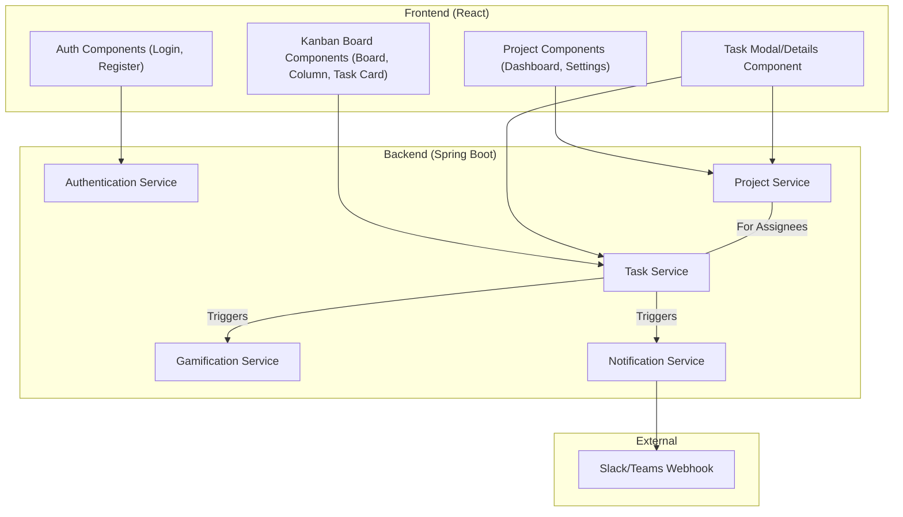

# Components

This section breaks down the TaskFlow application into its major logical components, covering both the backend services and the frontend UI modules.

## Component Diagram

## Backend Components

### Authentication Service
- **Responsibility:** Manages user registration, login, and JWT generation/validation.
- **Key Interfaces:** `POST /api/auth/register`, `POST /api/auth/login`.
- **Dependencies:** `User` data model, Security module (for password hashing).
- **Technology Stack:** Spring Security, JJWT library.

### Project Service
- **Responsibility:** Handles all business logic related to projects, including creation, updates, and member management.
- **Key Interfaces:** `GET /api/projects`, `POST /api/projects`, `PUT /api/projects/{id}`.
- **Dependencies:** `Project` and `User` data models.
- **Technology Stack:** Spring Boot, Spring Data JPA.

### Task Service
- **Responsibility:** Manages all business logic for tasks, comments, and attachments. Handles status updates and real-time notifications.
- **Key Interfaces:** `GET /api/projects/{id}/tasks`, `POST /api/tasks`, `PUT /api/tasks/{id}`, etc.
- **Dependencies:** `Task`, `Comment`, `Attachment` data models, `Gamification Service`, `Notification Service`.
- **Technology Stack:** Spring Boot, Spring Data JPA, Spring WebSockets.

### Gamification Service
- **Responsibility:** Contains the logic for awarding badges to users based on their actions (e.g., completing a certain number of tasks).
- **Key Interfaces:** Internal Java methods called by other services (e.g., `awardBadgesForTaskCompletion(User user)`).
- **Dependencies:** `Badge` and `User` data models.
- **Technology Stack:** Spring Boot.

### Notification Service
- **Responsibility:** Sends notifications to external services (Slack/Teams) via webhooks when configured.
- **Key Interfaces:** Internal Java methods (e.g., `sendTaskCompletionNotification(Task task)`).
- **Dependencies:** `Project` data model (to get webhook URL).
- **Technology Stack:** Spring Boot, HTTP Client (e.g., `RestTemplate` or `WebClient`).

## Frontend Components

### Auth Components
- **Responsibility:** Provide UI for user registration and login. Manage JWT storage in the client.
- **Key Interfaces:** Login form, Registration form.
- **Dependencies:** Authentication Service (backend).
- **Technology Stack:** React, Vitest/RTL.

### Project Components
- **Responsibility:** Display the main dashboard, list projects, and allow users to create and manage project settings.
- **Key Interfaces:** Project list view, "Create Project" modal, Project settings page.
- **Dependencies:** Project Service (backend).
- **Technology Stack:** React, Zustand (for state), Material-UI.

### Kanban Board Components
- **Responsibility:** Render the main Kanban view with columns and task cards. Handle drag-and-drop interactions for changing task status.
- **Key Interfaces:** Kanban board, Columns, Task cards.
- **Dependencies:** Task Service (backend), WebSockets for real-time updates.
- **Technology Stack:** React, a drag-and-drop library (e.g., `dnd-kit`), Material-UI.

### Task Modal/Details Component
- **Responsibility:** Display the full details of a task. Allow users to edit task properties, add comments, and attach files.
- **Key Interfaces:** Task detail modal/page.
- **Dependencies:** Task Service (backend).
- **Technology Stack:** React, Material-UI.
