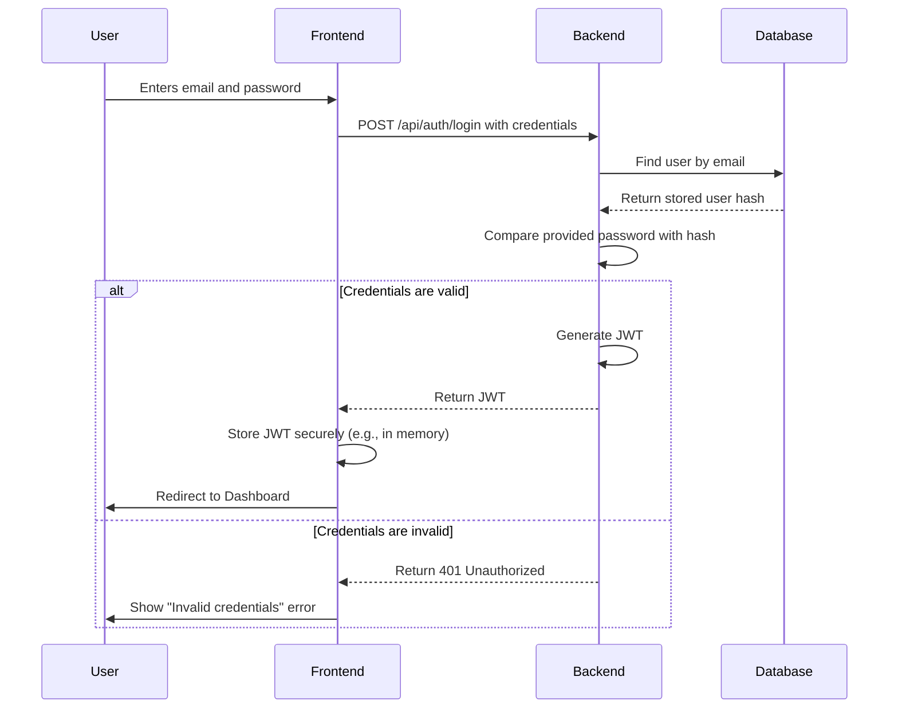
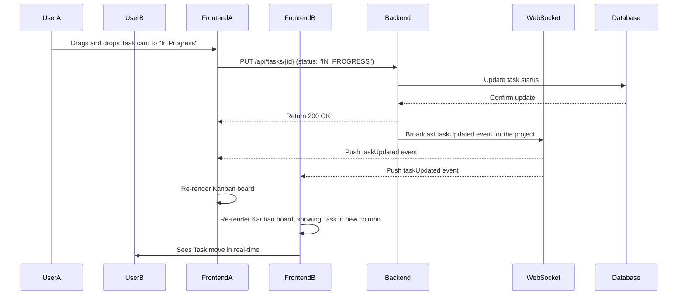

# Core Workflows

This section illustrates key user and system interactions using sequence diagrams.

## User Login Workflow

```mermaid
sequenceDiagram
    participant User
    participant Frontend
    participant Backend
    participant Database

    User->>Frontend: Enters email and password
    Frontend->>Backend: POST /api/auth/login with credentials
    Backend->>Database: Find user by email
    Database-->>Backend: Return stored user hash
    Backend->>Backend: Compare provided password with hash
    alt Credentials are valid
        Backend->>Backend: Generate JWT
        Backend-->>Frontend: Return JWT
        Frontend->>Frontend: Store JWT securely (e.g., in memory)
        Frontend->>User: Redirect to Dashboard
    else Credentials are invalid
        Backend-->>Frontend: Return 401 Unauthorized
        Frontend->>User: Show "Invalid credentials" error
    end
```

## Real-time Task Status Update Workflow

```mermaid
sequenceDiagram
    participant UserA
    participant UserB
    participant FrontendA
    participant FrontendB
    participant Backend
    participant WebSocket
    participant Database

    UserA->>FrontendA: Drags and drops Task card to "In Progress"
    FrontendA->>Backend: PUT /api/tasks/{id} (status: "IN_PROGRESS")
    Backend->>Database: Update task status
    Database-->>Backend: Confirm update
    Backend-->>FrontendA: Return 200 OK
    
    Backend->>WebSocket: Broadcast taskUpdated event for the project
    WebSocket-->>FrontendA: Push taskUpdated event
    WebSocket-->>FrontendB: Push taskUpdated event
    
    FrontendA->>FrontendA: Re-render Kanban board
    FrontendB->>FrontendB: Re-render Kanban board, showing Task in new column
    FrontendB->>UserB: Sees Task move in real-time
```
