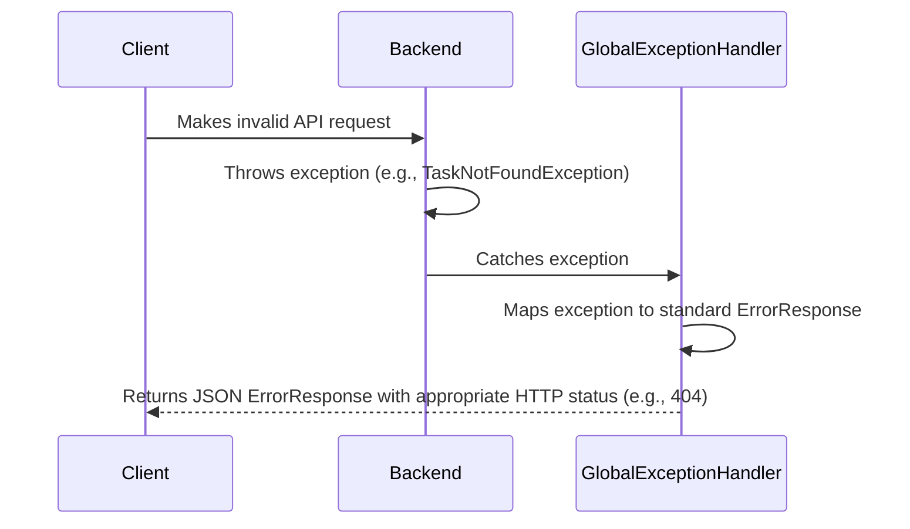

# Error Handling Strategy

## Error Flow


## Error Response Format
```typescript
interface ApiError {
  error: {
    code: string; // e.g., "TASK_NOT_FOUND"
    message: string; // "The requested task could not be found."
    timestamp: string; // ISO 8601
    requestId: string; // Unique ID for tracing
  };
}
```

## Frontend Error Handling
The API client service will catch errors and re-throw them in a consistent format for UI components to handle.
```typescript
// In a service
try {
  const response = await apiClient.get(...);
  return response.data;
} catch (error) {
  // Normalize and re-throw or handle error
  throw new Error(error.response?.data?.error?.message || 'An unknown error occurred');
}
```

## Backend Error Handling
A `@ControllerAdvice` class will handle exceptions globally.
```java
@ControllerAdvice
public class GlobalExceptionHandler {

    @ExceptionHandler(TaskNotFoundException.class)
    public ResponseEntity<ApiError> handleTaskNotFound(TaskNotFoundException ex) {
        ApiError error = new ApiError("TASK_NOT_FOUND", ex.getMessage(), ...);
        return new ResponseEntity<>(error, HttpStatus.NOT_FOUND);
    }
}
```
