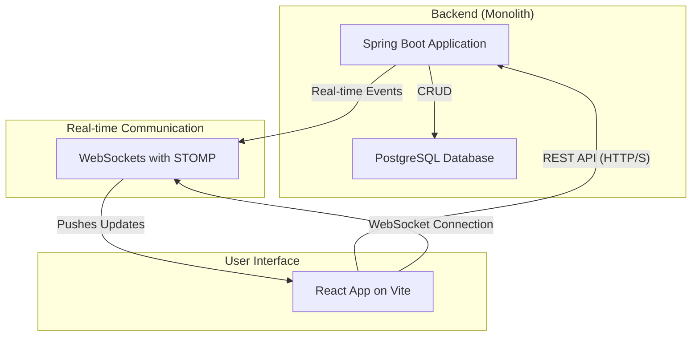

# High Level Architecture

## Technical Summary

This document outlines the architecture for TaskFlow, a desktop-first responsive web application designed to enhance productivity through a human-centric, reward-based system. The system will be built as a monolith with clear logical boundaries, utilizing a Java-based Spring Boot backend and a React (Vite) frontend with TypeScript. A PostgreSQL database will handle data persistence, while real-time communication for collaborative features will be managed via WebSockets (STOMP). The entire project will be housed in a monorepo to streamline development and ensure consistency. This architecture directly supports the PRD goals by providing a scalable, maintainable, and secure foundation for the core task management, collaboration, and gamification features.

## Platform and Infrastructure Choice

**Platform:** Local-Only for MVP
**Key Services:** N/A (Local machine hosting)
**Deployment Host and Regions:** N/A (Local machine hosting)
**Rationale:** As per the PRD, the initial MVP will be for local hosting and development only. No cloud infrastructure is required at this stage.

## Repository Structure

**Structure:** Monorepo
**Monorepo Tool:** Standard NPM/Maven workspaces. No specialized tool like Nx or Turborepo is required for the MVP's complexity.
**Package Organization:** The monorepo will contain two primary packages: `backend` for the Spring Boot application and `frontend` for the React/Vite application. A `packages/shared-types` directory may be added later if needed for sharing TypeScript interfaces.

## High Level Architecture Diagram

## Architectural Patterns

- **Monolithic Architecture:** The application will be built as a single, unified service. _Rationale:_ This simplifies development, testing, and deployment for the MVP, aligning with NFR4. Clear logical boundaries will be maintained to allow for future migration to microservices if needed.
- **Repository Pattern:** The backend will use the repository pattern to abstract data access logic from the business logic. _Rationale:_ This improves testability and allows for easier changes to the underlying data source in the future.
- **REST API:** The primary communication between the frontend and backend will be via a RESTful API. _Rationale:_ This is a mature, well-understood standard that provides a clear and stateless contract between the client and server.
- **Component-Based UI:** The frontend will be built using reusable React components. _Rationale:_ This promotes maintainability, reusability, and a consistent user interface.
- **Real-time Communication (Observer Pattern):** WebSockets will be used to push real-time updates to clients. _Rationale:_ This is essential for collaborative features like the Kanban board, ensuring all users see changes instantly (NFR3, NFR5).
