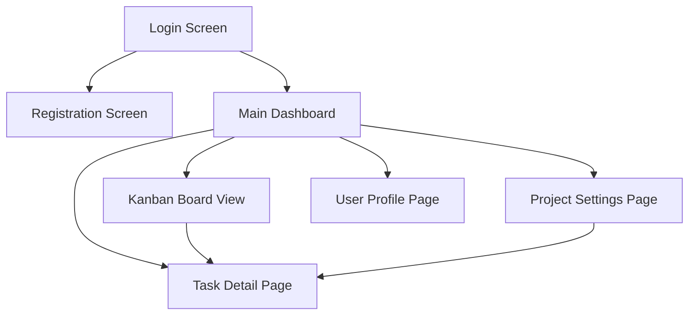
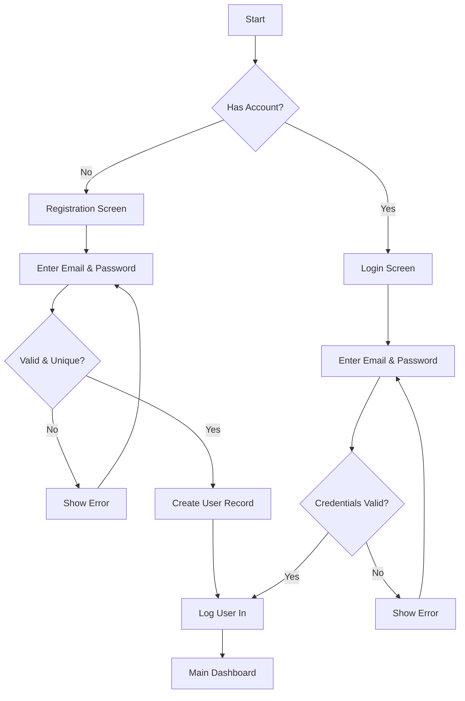
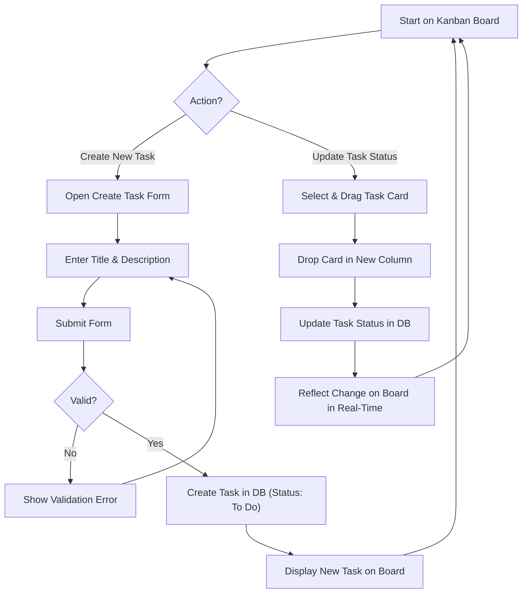

# TaskFlow UI/UX Specification

## Introduction

This document defines the user experience goals, information architecture, user flows, and visual design specifications for TaskFlow's user interface. It serves as the foundation for visual design and frontend development, ensuring a cohesive and user-centered experience.

### Overall UX Goals & Principles

#### Target User Personas

*   **Administrator:** System managers who need control and oversight capabilities.
*   **Manager:** Team leads and project managers who organize workstreams, assign tasks, and monitor team progress.
*   **Collaborator:** Team members who perform the tasks, collaborate with others, and want to feel recognized for their contributions.

#### Usability Goals

*   **High Engagement:** Achieve at least 60% monthly utilization of key gamification and reward features.
*   **Task Success:** Ensure users can successfully complete at least 80% of their assigned tasks by the due date.
*   **User Satisfaction:** Attain an average user satisfaction score of 4.0/5.0 or higher in user surveys.
*   **Efficiency:** Allow users to create, update, and manage tasks with minimal cognitive load and effort.

#### Design Principles

1.  **Rewarding & Engaging:** The interface should make task management feel rewarding, not like a chore, through seamless and non-distracting gamification.
2.  **Clarity & Intuition:** Prioritize a clean, modern, and user-friendly design that minimizes cognitive load.
3.  **Collaborative & Real-Time:** The design must support fluid, real-time interactions to foster seamless team collaboration.
4.  **Professional yet Approachable:** The branding and aesthetic should feel modern and professional, while also being positive and human-centric.
5.  **Accessible by Default:** The application will adhere to WCAG AA standards to ensure it is usable by everyone.

### Change Log

| Date | Version | Description | Author |
|---|---|---|---|

## Information Architecture (IA)

This section will define the structure and organization of the content within TaskFlow, ensuring users can easily find what they need and understand where they are in the application.

#### Site Map / Screen Inventory

#### Navigation Structure

*   **Primary Navigation:** The main dashboard will likely feature primary navigation elements to access Projects, Tasks (Kanban Board), and potentially a quick link to the User Profile.
*   **Secondary Navigation:** Within a project, secondary navigation might include filters for tasks, sorting options, and access to project-specific settings.
*   **Breadcrumb Strategy:** A breadcrumb trail will be used to indicate the user's current location within the application hierarchy, especially when navigating into specific projects or tasks.

## User Flows

#### Onboarding: Registration & Login

**User Goal:** To create a new account or access an existing account to use TaskFlow.

**Entry Points:**
*   Navigating to the application's root URL for the first time.
*   Being logged out and returning to the application.

**Success Criteria:**
*   A new user successfully creates an account and is logged in.
*   An existing user successfully logs in and is taken to their main dashboard.

**Flow Diagram**

**Edge Cases & Error Handling:**
*   User enters an email that is already registered.
*   User enters a password that doesn't meet security requirements (e.g., too short).
*   User enters incorrect login credentials.
*   User forgets their password (Note: Password reset flow is not in MVP but should be considered).

#### Core Task Management: Create, View, and Update Tasks

**User Goal:** To create a new task, view it on the Kanban board, and update its status by moving it.

**Entry Points:**
*   Clicking a "Create Task" button from the Main Dashboard or Kanban Board.
*   Interacting with the Kanban board to view and move tasks.

**Success Criteria:**
*   A user can successfully create a new task, and it appears in the "To Do" column.
*   A user can drag a task from one column (e.g., "To Do") and drop it into another (e.g., "In Progress").
*   The task's status is updated in real-time for all project members.

**Flow Diagram**

**Edge Cases & Error Handling:**
*   User tries to create a task without a title.
*   A network error occurs while creating or updating a task.
*   Two users attempt to move the same task simultaneously (the system should gracefully handle the conflict, likely on a first-come, first-served basis).

## Wireframes & Mockups

This section will clarify where the detailed visual designs will be created and how they will be referenced. If low-fidelity wireframes are needed, I can help conceptualize layouts for key screens.

## Component Library / Design System

This section outlines our approach to building and utilizing the design system, which is essential for maintaining consistency, efficiency, and scalability in our UI development.

#### Design System Approach

As specified in the `tech-stack.md` document, TaskFlow will use **Material-UI (MUI) v5** as its primary UI component library. Our approach will be to:

*   **Leverage MUI as the Foundation:** Utilize MUI's comprehensive set of pre-built React components to accelerate development and ensure a high-quality, accessible, and modern user interface.
*   **Customize via Theming:** Use MUI's built-in theming capabilities and the Emotion CSS-in-JS framework to customize colors, typography, and spacing to align with TaskFlow's unique branding and aesthetic.
*   **Create Custom Components Sparingly:** Develop new, custom components only when a specific requirement cannot be met by an existing MUI component or a composition of them. These will be organized within the `src/components/common/` directory as outlined in the frontend architecture.

#### Core Components to be Utilized

We will primarily use the following core MUI components to build the interface:

*   **Layout:** `Box`, `Container`, `Grid`, `Stack`
*   **Inputs:** `Button`, `TextField`, `Select`, `Checkbox`, `RadioGroup`
*   **Navigation:** `AppBar`, `Tabs`, `Breadcrumbs`, `Drawer`
*   **Data Display:** `Card`, `Chip` (for badges), `List`, `Table`, `Tooltip`
*   **Feedback:** `Alert`, `Dialog` (Modal), `Snackbar` (Toast), `Skeleton`
*   **Surfaces:** `Paper`, `Accordion`

## Branding & Style Guide

This section outlines the visual identity and style guidelines for TaskFlow, ensuring a consistent and cohesive brand experience across the application. While formal brand guidelines are still evolving, this document will establish the foundational elements.

#### Visual Identity

**Brand Guidelines:** The overall visual identity for TaskFlow will convey **modern professionalism combined with an approachable, positive, and rewarding aesthetic**. The design will support the "human and rewarding" value proposition, integrating gamification elements subtly to enhance motivation without distraction.

#### Color Palette

Given the use of Material-UI, we will define a custom color palette that aligns with the brand's aesthetic. This will involve selecting primary, secondary, and accent colors, along with semantic colors for success, warning, and error states, and a range of neutral colors for text and backgrounds.

| Color Type | Hex Code | Usage |
| :--------- | :------- | :---- |
| Primary    | `{{primary_color}}` | `{{primary_usage}}` (e.g., main interactive elements, branding) |
| Secondary  | `{{secondary_color}}` | `{{secondary_usage}}` (e.g., complementary actions, secondary branding) |
| Accent     | `{{accent_color}}` | `{{accent_usage}}` (e.g., gamification highlights, calls to action) |
| Success    | `#4CAF50` | Positive feedback, confirmations |
| Warning    | `#FFC107` | Cautions, important notices |
| Error      | `#F44336` | Errors, destructive actions |
| Neutral    | `{{neutral_colors}}` | Text, borders, backgrounds (e.g., shades of grey) |

#### Typography

We will select font families and define a type scale to ensure readability and visual hierarchy.

##### Font Families

*   **Primary:** `{{primary_font}}` (e.g., a modern sans-serif for headings and body text)
*   **Secondary:** `{{secondary_font}}` (e.g., a complementary sans-serif or serif for specific elements)
*   **Monospace:** `{{mono_font}}` (e.g., for code snippets or technical information)

##### Type Scale

| Element | Size | Weight | Line Height |
| :------ | :--- | :----- | :---------- |
| H1      | `{{h1_size}}` | `{{h1_weight}}` | `{{h1_line}}` |
| H2      | `{{h2_size}}` | `{{h2_weight}}` | `{{h2_line}}` |
| H3      | `{{h3_size}}` | `{{h3_weight}}` | `{{h3_line}}` |
| Body    | `{{body_size}}` | `{{body_weight}}` | `{{body_line}}` |
| Small   | `{{small_size}}` | `{{small_weight}}` | `{{small_line}}` |

#### Iconography

**Icon Library:** We will primarily use **Material Icons** (from Material-UI) to maintain consistency with the chosen component library.

**Usage Guidelines:** Icons will be used to enhance usability, provide visual cues, and support the gamification elements (e.g., badges). Consistency in size, style, and color will be maintained.

#### Spacing & Layout

**Grid System:** We will utilize Material-UI's responsive `Grid` component for layout, providing a flexible and consistent spacing system.

**Spacing Scale:** A consistent spacing scale (e.g., based on an 8px or 4px grid) will be applied throughout the design to ensure visual harmony and alignment.

## Accessibility Requirements

This section outlines the specific accessibility requirements for TaskFlow, ensuring the application is usable by individuals with diverse abilities.

#### Compliance Target

**Standard:** TaskFlow will aim to comply with **WCAG (Web Content Accessibility Guidelines) 2.1 Level AA**. This standard is explicitly mentioned in the PRD under "User Interface Design Goals."

#### Key Requirements

Based on WCAG 2.1 AA and general best practices, key requirements will include:

**Visual:**
*   **Color contrast ratios:** Ensure sufficient contrast between text and background colors (minimum 4.5:1 for normal text, 3:1 for large text).
*   **Focus indicators:** Provide clear and visible focus indicators for all interactive elements (buttons, links, form fields) for keyboard users.
*   **Text sizing:** Allow users to resize text up to 200% without loss of content or functionality.

**Interaction:**
*   **Keyboard navigation:** All interactive elements must be operable via keyboard alone, following a logical tab order.
*   **Screen reader support:** Ensure all UI elements, images, and interactive components are properly labeled and structured for screen reader interpretation (e.g., using ARIA attributes).
*   **Touch targets:** Provide sufficiently large touch targets for mobile and tablet users to prevent accidental activation.

**Content:**
*   **Alternative text:** All meaningful images and non-text content must have appropriate alternative text.
*   **Heading structure:** Use a logical and hierarchical heading structure (`<h1>`, `<h2>`, etc.) to convey content organization.
*   **Form labels:** All form fields must have associated, visible labels.

#### Testing Strategy

**Accessibility Testing:** We will incorporate accessibility testing throughout the development lifecycle. This will include:
*   **Automated tools:** Using tools like Lighthouse, Axe, or similar during development and CI/CD.
*   **Manual testing:** Conducting manual keyboard navigation tests and screen reader tests (e.g., with NVDA, VoiceOver).
*   **User testing:** Including users with disabilities in usability testing sessions where feasible.

## Responsiveness Strategy

This section outlines how TaskFlow's user interface will adapt to different screen sizes and devices, ensuring a consistent and optimal experience across desktop, tablet, and mobile resolutions. The application will follow a desktop-first responsive web design approach, as specified in the PRD.

#### Breakpoints

We will define standard breakpoints to guide the adaptation of layouts and components. These are typical breakpoints for responsive web applications:

| Breakpoint | Min Width | Max Width | Target Devices |
| :--------- | :-------- | :-------- | :------------- |
| Mobile     | -         | `599px`   | Smartphones (portrait) |
| Tablet     | `600px`   | `959px`   | Tablets (portrait and landscape), small laptops |
| Desktop    | `960px`   | `1279px`  | Standard desktop monitors |
| Wide       | `1280px`  | -         | Large desktop monitors, ultrawide displays |

#### Adaptation Patterns

**Layout Changes:**
*   **Desktop:** Full-width layouts, multi-column structures, persistent sidebars.
*   **Tablet:** Collapsible sidebars, potentially fewer columns, optimized spacing.
*   **Mobile:** Single-column layouts, bottom navigation bars, off-canvas menus.

**Navigation Changes:**
*   **Desktop:** Prominent global navigation (e.g., top bar, persistent sidebar).
*   **Mobile/Tablet:** Hamburger menus or bottom navigation for primary actions, contextual menus for secondary actions.

**Content Priority:**
*   Content will be prioritized to ensure the most critical information and actions are visible and accessible on smaller screens. Less critical information may be progressively disclosed or moved to secondary views.

**Interaction Changes:**
*   Emphasis on touch-friendly interactions for mobile and tablet devices (e.g., larger touch targets, swipe gestures where appropriate).
*   Drag-and-drop functionality (e.g., for Kanban board) will be optimized for both mouse and touch interfaces.

## Animation & Micro-interactions

This section outlines the principles and key applications of motion design within TaskFlow, focusing on enhancing user experience, providing feedback, and subtly integrating gamification elements. Performance and accessibility will be key considerations.

#### Motion Principles

*   **Purposeful:** Every animation should serve a clear purpose, such as guiding user attention, providing feedback, or indicating state changes. Avoid gratuitous animations.
*   **Subtle & Smooth:** Animations should be subtle, fluid, and contribute to a sense of polish without being distracting or causing motion sickness.
*   **Fast & Responsive:** Interactions should feel immediate. Animations should be quick enough not to impede user flow, typically under 300ms for most UI transitions.
*   **Consistent:** Apply consistent easing curves and durations across similar interactions to create a predictable experience.
*   **Delightful (Gamification):** Use micro-interactions and animations to provide positive feedback for gamification elements (e.g., earning a badge), making the experience more rewarding.

#### Key Animations & Micro-interactions

*   **Task Card Movement:** Smooth transitions when dragging and dropping task cards on the Kanban board. (Duration: `~200ms`, Easing: `ease-out`)
*   **Badge Earned Notification:** A subtle, celebratory animation or toast notification when a user earns a new badge. (Duration: `~500ms`, Easing: `ease-in-out`)
*   **Button States:** Visual feedback (e.g., slight scale, color change) on hover, active, and disabled states for buttons. (Duration: `~100ms`, Easing: `ease-in-out`)
*   **Form Field Focus:** A clear, subtle animation or highlight when a form field gains focus. (Duration: `~150ms`, Easing: `ease-out`)
*   **Loading Indicators:** Engaging but non-intrusive loading spinners or progress bars for asynchronous operations. (Duration: `continuous`, Easing: `linear`)
*   **Menu/Sidebar Toggle:** Smooth slide-in/slide-out animations for navigation menus or sidebars. (Duration: `~250ms`, Easing: `ease-in-out`)

## Performance Considerations

This section outlines the performance goals and design strategies that will directly impact the user experience of TaskFlow. Ensuring a fast and responsive application is crucial for user satisfaction and engagement.

#### Performance Goals

*   **Page Load:** Initial page load (First Contentful Paint, Largest Contentful Paint) should be under **2 seconds** on a typical broadband connection.
*   **Interaction Response:** User interface interactions (e.g., button clicks, task drag-and-drop) should have a response time of under **100ms** to feel instantaneous.
*   **Real-time Updates:** As per NFR3, real-time interactions (e.g., moving a task on the Kanban board) must be reflected for all connected users **near-instantly** (ideally under 500ms end-to-end latency).
*   **Animation FPS:** Animations and transitions should maintain a smooth **60 frames per second (FPS)** to avoid jankiness.

#### Design Strategies

*   **Optimized Asset Loading:** Implement lazy loading for images and other non-critical assets. Optimize image sizes and formats.
*   **Efficient Data Fetching:** Utilize client-side caching (e.g., with TanStack Query as mentioned in `frontend-architecture.md`) to minimize redundant API calls and improve perceived load times.
*   **Minimalist UI:** Keep the UI clean and avoid unnecessary visual clutter that could impact rendering performance.
*   **Debouncing/Throttling:** Apply debouncing or throttling to frequent user inputs (e.g., search, resizing) to reduce unnecessary processing.
*   **Virtualization:** For lists or tables with many items (e.g., a very long task list), consider UI virtualization to render only visible items.
*   **Backend Optimization:** Collaborate with backend developers to ensure API endpoints are performant and return only necessary data.

## Next Steps

After completing this UI/UX specification, the following immediate actions and considerations are recommended to move TaskFlow forward:

#### Immediate Actions

1.  **Stakeholder Review:** Schedule a comprehensive review of this UI/UX Specification with all key stakeholders (Product Owner, Project Manager, Lead Developer, QA Lead) to gather feedback and secure final approval.
2.  **Visual Design & Prototyping:** Begin creating high-fidelity visual designs and interactive prototypes in the chosen design tool (e.g., Figma) based on this specification.
3.  **Frontend Architecture Handoff:** Prepare for a detailed handoff to the Design Architect and frontend development team, ensuring they have all necessary context for implementation.
4.  **Refine Branding & Style Guide:** Finalize the specific values for the color palette, typography, and other visual elements in the Branding & Style Guide section.

#### Design Handoff Checklist

To ensure a smooth transition to development, the following items should be confirmed:

*   All user flows documented
*   Component inventory complete
*   Accessibility requirements defined
*   Responsive strategy clear
*   Brand guidelines incorporated
*   Performance goals established

## Checklist Results

As no specific UI/UX checklist was provided or executed against this document, there are no formal checklist results to report at this time.
