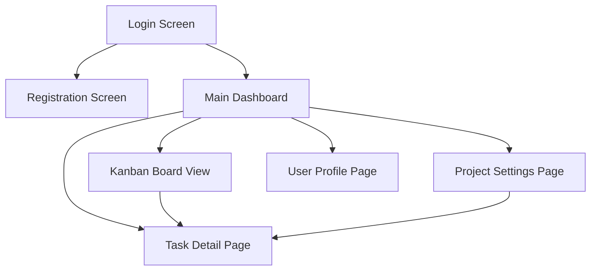

# Information Architecture (IA)

This section will define the structure and organization of the content within TaskFlow, ensuring users can easily find what they need and understand where they are in the application.

### Site Map / Screen Inventory

### Navigation Structure

*   **Primary Navigation:** The main dashboard will likely feature primary navigation elements to access Projects, Tasks (Kanban Board), and potentially a quick link to the User Profile.
*   **Secondary Navigation:** Within a project, secondary navigation might include filters for tasks, sorting options, and access to project-specific settings.
*   **Breadcrumb Strategy:** A breadcrumb trail will be used to indicate the user's current location within the application hierarchy, especially when navigating into specific projects or tasks.
