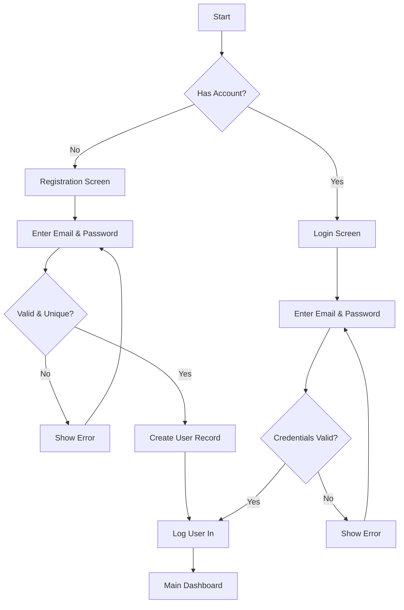
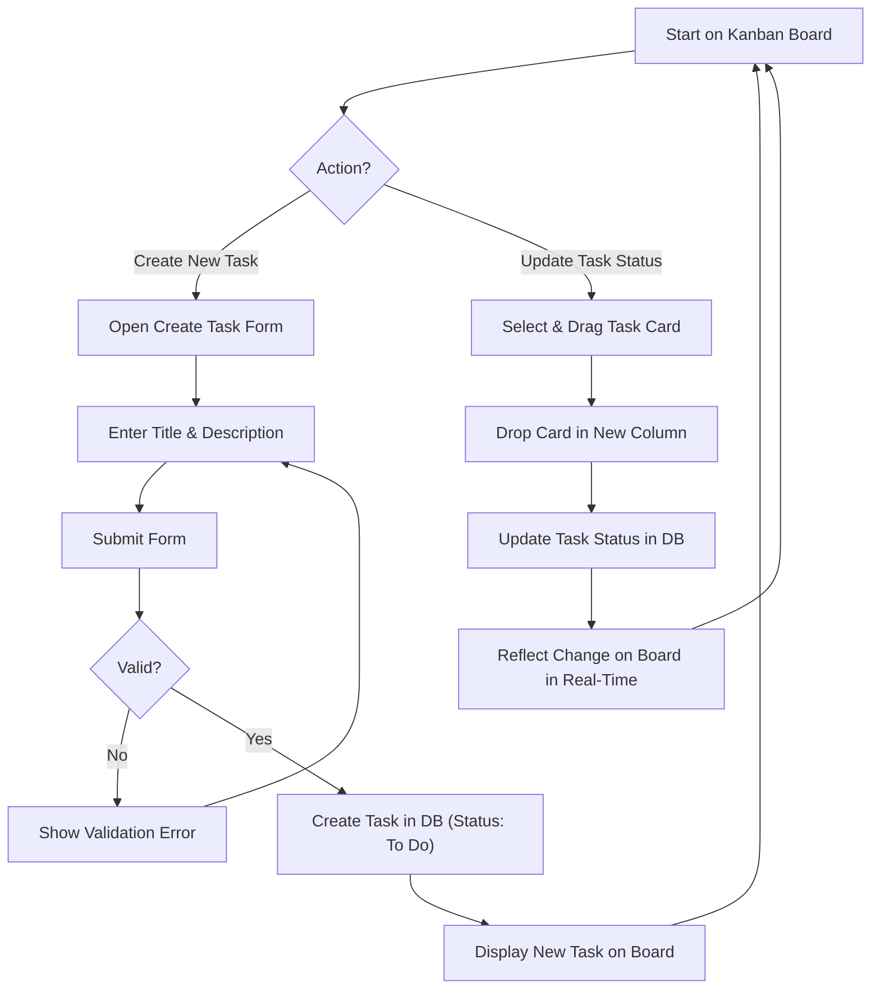

# User Flows

### Onboarding: Registration & Login

**User Goal:** To create a new account or access an existing account to use TaskFlow.

**Entry Points:**
*   Navigating to the application's root URL for the first time.
*   Being logged out and returning to the application.

**Success Criteria:**
*   A new user successfully creates an account and is logged in.
*   An existing user successfully logs in and is taken to their main dashboard.

**Flow Diagram**

**Edge Cases & Error Handling:**
*   User enters an email that is already registered.
*   User enters a password that doesn't meet security requirements (e.g., too short).
*   User enters incorrect login credentials.
*   User forgets their password (Note: Password reset flow is not in MVP but should be considered).

### Core Task Management: Create, View, and Update Tasks

**User Goal:** To create a new task, view it on the Kanban board, and update its status by moving it.

**Entry Points:**
*   Clicking a "Create Task" button from the Main Dashboard or Kanban Board.
*   Interacting with the Kanban board to view and move tasks.

**Success Criteria:**
*   A user can successfully create a new task, and it appears in the "To Do" column.
*   A user can drag a task from one column (e.g., "To Do") and drop it into another (e.g., "In Progress").
*   The task's status is updated in real-time for all project members.

**Flow Diagram**

**Edge Cases & Error Handling:**
*   User tries to create a task without a title.
*   A network error occurs while creating or updating a task.
*   Two users attempt to move the same task simultaneously (the system should gracefully handle the conflict, likely on a first-come, first-served basis).
